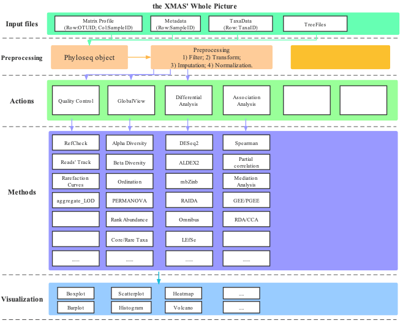

# Material in this tutorial

## Resources

There are two resources in this tutorial. One is from in-house 16s standard pipeline and the other is from metaphlan2 workflow. All these data have been stored into **XMAS 2.0**.

### DADA2 

**dada2** result from standardized_analytics_workflow_R_function.

1. /home/xuxiaomin/project/standardized_analytics_workflow_R_function/demo_data/16S/process/xdada2/dada2_res.rds

2. /home/xuxiaomin/project/standardized_analytics_workflow_R_function/demo_data/16S/process/fasta2tree/tree.nwk

3. /home/xuxiaomin/project/standardized_analytics_workflow_R_function/demo_data/16S/metadata.txt

### Metaphlan2

The result of the in-house **[Metaphlan2/3](https://huttenhower.sph.harvard.edu/metaphlan2)** pipeline.

1. /home/xuxiaomin/project/standardized_analytics_workflow_R_function/demo_data/MGS/metaphlan2_merged.tsv

2. /home/xuxiaomin/project/standardized_analytics_workflow_R_function/demo_data/MGS/metadata.txt

## Overview of the design of **XMAS** package

```{r, echo=FALSE, dpi=600, fig.align="center", out.width="100%", out.height="100%", fig.cap="The Overview of the design of XMAS package"}

```


**XMAS 2.0** contains several modules, such as *preprocessing*, *actions*, *methods* and *visualization*. Furthermore, the extended parts of actions module give this package more flexible ability to add new parts. We also separate scripts into calculation and visualization parts by their names. The functions' prefix with *run* is used for calculation, and the functions' prefix with *plot* is used for visualization. 

### Description

**XMAS 2.0** is comprised of R functions for in-house use, including functions for *statistical*, *functional*, and *visual* analysis of microbiol data, and is still underdevelopment.


Here, we provide the [first ultimate version (v2.1.0) of XMAS 2.0](https://gitlab.com/BangzhuoTong/xmas/-/releases) and users can download it.


### Installation of dependent packages

Requiring the R-base version more than **3.6.3**. Some of the dependencies are uploaded to CRAN or bioconductor website, but others, which are underdevelopment are only obtained from github website. Dependencies version (optional but not required):

* Biostrings  (>= 2.22.0)
* BiocGenerics (>= 0.32.0)
* phyloseq (>= 1.30.0)
* forcats (>= 0.5.1)
* stringr (>= 1.4.0)
* ggplot2 (>= 3.3.5)
* readr (>= 1.4.0)
* ALDEx2 (>= 1.18.0)
* dplyr (>= 1.0.8)
* tibble (>= 3.1.6)
* DT (>= 0.18)
* purrr (>= 0.3.4)
* metagenomeSeq (>= 1.28.0)
* edgeR (>= 3.28.1)
* DESeq2 (>= 1.26.0)
* limma (>= 3.42.2)
* mbzinb (>= 0.2)
* pscl (>= 1.5.5)
* methods (>= 3.6.3)
* matrixStats (>= 0.58.0)
* RAIDA (>= 1.0)
* compositions (>= 2.0-4)
* vegan (>= 2.5-7)
* coin (>= 1.4-2)
* SummarizedExperiment (>= 1.16.1)
* MASS (>= 7.3-53.1)
* Biobase (>= 2.46.0)
* nlme (>= 3.1-152)
* tidyr (>= 1.1.3)
* corncob (>= 0.2.0)
* Maaslin2 (>= 1.7.3)
* ggrepel (>= 0.9.1)
* ggpubr (>= 0.4.0)
* ggalluvial (>= 0.12.3)
* Hmisc (>= 4.5-0)
* RColorBrewer (>= 1.1-2)
* umap (>= 0.2.8.0)
* ape (>= 5.6-2)
* cowplot (>= 1.1.1)
* Rtsne (>= 0.15)
* ade4 (>= 1.7-18)
* scales (>= 1.1.1)
* ggVennDiagram (>= 1.2.1)
* impute (>= 1.68.0)
* pheatmap (>= 1.0.12)

There are two methods to install the aforementioned packages.

#### Packages in CRAN & Bioconductor
```R
install.packages("pacman")

library(pacman)

pacman::p_load(Biostrings, BiocGenerics, phyloseq, forcats, stringr, ggplot2, 
        readr, ALDEx2, dplyr, tibble, DT, purrr, metagenomeSeq, stats, edgeR, 
        DESeq2, methods, limma, pscl, matrixStats, compositions, vegan, coin,
        SummarizedExperiment, MASS, Biobase, nlme, tidyr, Maaslin2, ggrepel,
        ggpubr, ggalluvial, Hmisc, umap, Rtsne, ape, cowplot, scales, ade4,
        ggVennDiagram, impute, pheatmap)
```

#### Packages in github
```R
# Step 1: Install devtools
if (!requireNamespace(c("remotes", "devtools"), quietly=TRUE)) {
  install.packages(c("devtools", "remotes"))
}
library(devtools)
#library(remotes)

# Step 2: install corncob package
devtools::install_github("bryandmartin/corncob")
# remotes::install_github("bryandmartin/corncob")
```

#### Packages from website

Manual download of RAIDA_1.0.tar.gz from [here](http://cals.arizona.edu/~anling/software/RAIDA_1.0.tar.gz) and install locally 
```shell
R CMD INSTALL RAIDA_*.tar.gz

```
```R
install.packages("RAIDA_1.0.tar.gz", repos = NULL, type = "source")
```

Manual download of mbzinb_0.2.tar.gz from [here](https://github.com/jchen1981/MicrobiomeDDA/blob/master/mbzinb_0.2.tar.gz) and install locally 
```shell
R CMD INSTALL mbzinb_*.tar.gz

```
```R
install.packages("mbzinb_0.2.tar.gz", repos = NULL, type = "source")
```


### Installation

Get the **XMAS** released version from [Release version](https://gitlab.com/BangzhuoTong/xmas/-/releases)

#### Installation in linux or Mac os through command line

Using git command to download the whole repository and then install this package by linux command line.

```shell
git clone git@gitlab.com:BangzhuoTong/xmas.git
R CMD build xmas
R CMD INSTALL XMAS_*.tar.gz
```

#### Installation by R from gitlab 
```R
# Step 1: Install devtools
install.packages(c("devtools", "remotes"))
library(devtools)
#library(remotes)

# Step 2: install xmas package
devtools::install_gitlab("BangzhuoTong/xmas") # remotes::install_github("BangzhuoTong/xmas")
```

#### Installation by R from local XMAS*.tar.gz file

Downloading the tar.gz file from the gitlab website, and then use the following command to install it.

```R
install.packages("XMAS*.tar.gz", repos = NULL, type = "source")
```


### Vignette

For detailed tutorials on how to use **XMAS**, please refer to the R package vignettes. Choosing the `html` format to do a practice. Hope you have fun with **XMAS**.

```R
utils::browseVignettes(package="XMAS")
```

### Authors

1. [Bangzhuo Tong](tongbangzhuo@xbiome.com)
2. [Hua Zou](zouhua@xbiome.com)


### library package
```R
library(XMAS)
```

## Future plan

**XMAS 2.0**, which developed for data analysis, is part of the X-therapia platform and we will update it with more and more data analysis module and also add new functions according to the in-house requirements to support the company.

We welcome any comments and requirements and hope users give issues on the gitlab issues module.


## Systematic Information
```{r}
sessionInfo()
```
